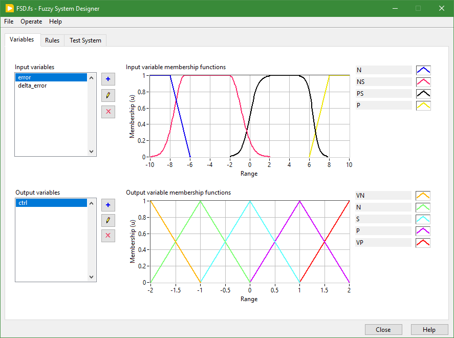
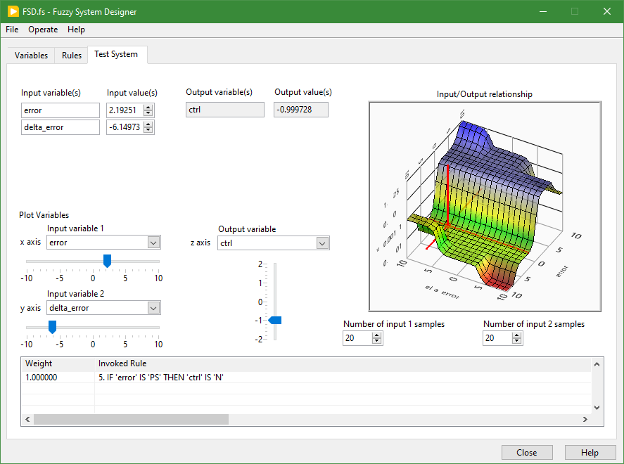
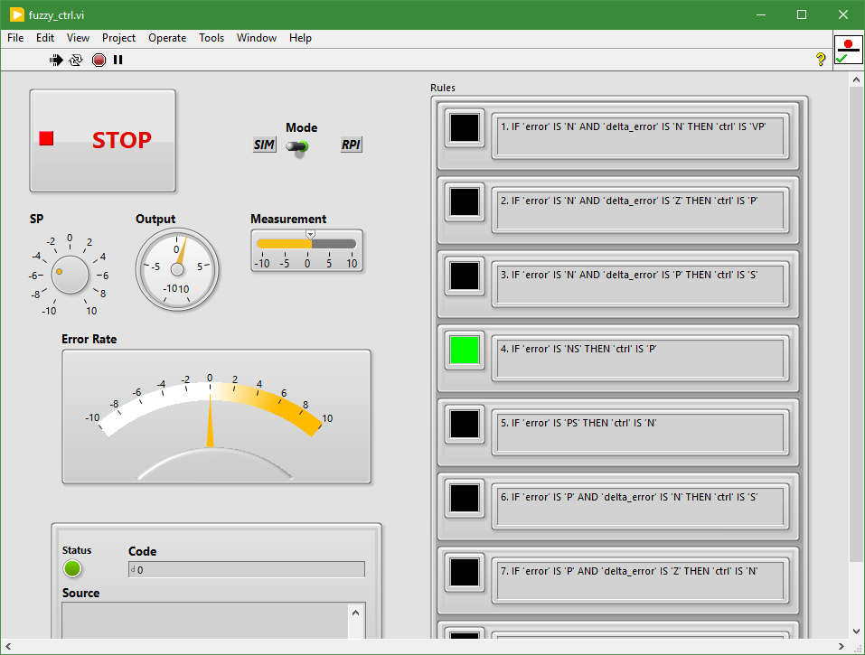
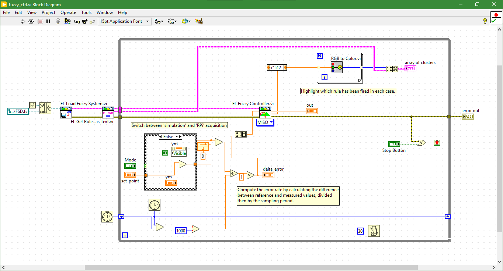

# Fuzzy Control of an Articulated System

## Description

## Technical Details

### Hardware

### Software

## Acknowledgment
The present project is inspired by the following reference: [https://github.com/hugomarquez/ball_and_beam](https://github.com/hugomarquez/ball_and_beam)

## LICENSE
See the [LICENSE](LICENSE) file for license rights and limitations (MIT).
