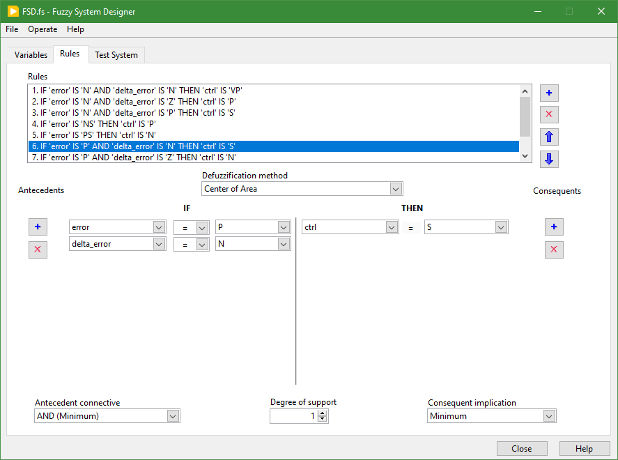

# Fuzzy Control of an Articulated System

## Description
In this project, a fuzzy control system is implemented for an articulated system. It consists of a disc that moves along a track. The goal of the system is to control the speed of the disc so that it follows the track. The system's behavior is governed by a fuzzy controller that uses, as inputs, the error between the set point and actual measured positions, and the error rate _(The speed is approximated mathematically by the derivative of the position.)_. The controller outputs then a control signal that is used to adjust the angle of the beam, which is controlled by a servo motor.

## Technical Details

### Hardware
The system is composed of the following components:
- a disc that moves along a track;
- a beam that is controlled by a servo motor;
- an ultrasonic sensor that measures the position of the disc;
- a Raspberry Pi that serves as an acquisition board.

### Software
`LabVIEW` is used to implement the fuzzy controller.

## Acknowledgment
The present project is inspired by the following reference: [https://github.com/hugomarquez/ball_and_beam](https://github.com/hugomarquez/ball_and_beam)

## LICENSE
See the [LICENSE](LICENSE) file for license rights and limitations (MIT).
